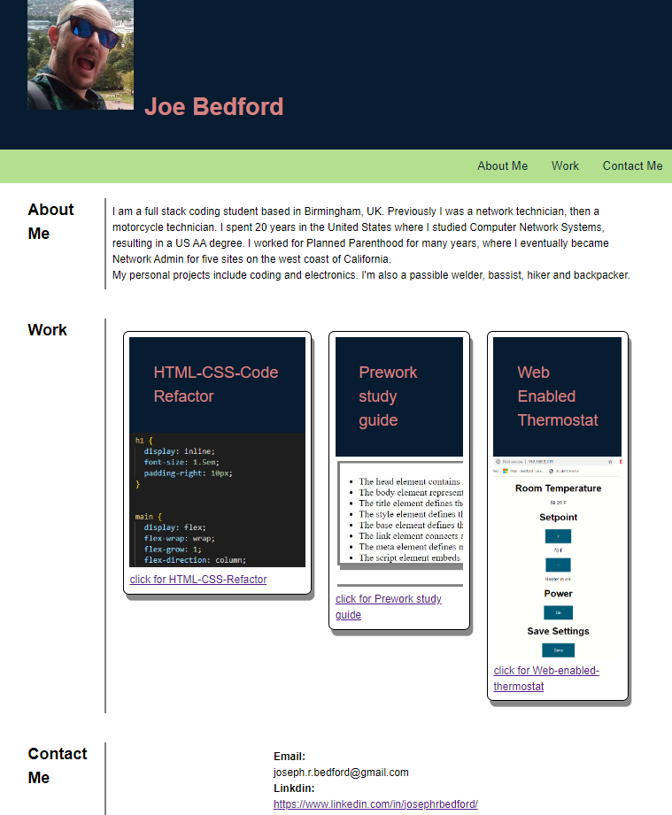

# README - html-css-refactor

Birmingham coding bootcamp week two challenge was to create a portfolio of current work.

## Description

The webpage needs to meet accessibility standards, use semantic HTML elements which follow a logical structure, use alt attributes in pictures, use sequential heading attributes and a concise, descriptive title. It needs the developer's name, photo, work and contact info. The UI needs to scroll to the relevant section when clicked in the NAV bar.

The first application card should be larger than the others. Images of the applications when clicked should take you to the deployed application.

Resizing should be responsive and should show on various size viewports.

## Installation

N/A

## Usage

Navigate to https://josephrbedford.github.io/portfolio/ to view the refactored webpage.

## Credits

Loosely based on week 2 class 10 Stu_box-styling and clickable card tutorial at https://play.tailwindcss.com/q0Pje5H2Br.

## License

Please refer to the LICENSE in the repo.

## Screenshot

